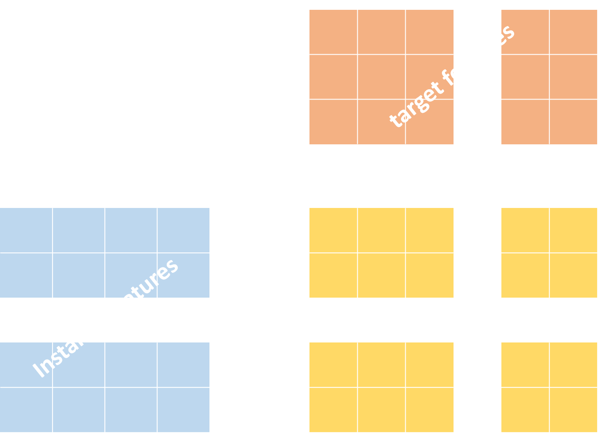

<p align="center"></p>

<h3 align="center">
<p> A Deep Learning Framework for Multi-target Prediction </h3>

This is the official repository of DeepMTP, a deep learning framework that can be used with multi-target prediction (MTP) problems. MTP can be seen as an umbrella term that cover many subareas of machine learning, which include multi-label classification (MLC), multivariate regression (MTR), multi-task learning (MTL), dyadic prediction (DP), and matrix completion (MC). The implementation is mainly written in Python and uses Pytorch for the implementation of the neural network. The goal is for any user to be able to train a model using only a few lines of code.

### Latest Updates
- [1/6/2022] The first implementation of DeepMTP is now live!!!


## Background

## What is MTP??
Multi-target prediction (MTP) serves as an umbrella term for machine learning tasks that concern the simultaneous prediction of multiple target variables. These include:
* Multi-label Classification
* Multivariate Regression
* Multitask Learning
* Hierarchical Multi-label Classification
* Dyadic Prediction
* Zero-shot Learning
* Matrix Completion
* (Hybrid) Matrix Completion
* Cold-start Collaborative Filtering

Despite the significant similarities, all these domains have evolved separately into distinct research areas over the last two decades. To better understand these similarities and differences it is important to get accustomed to the terminology and main concepts used in this field.

<p align="center"></p>

A multi-target prediction problem is characterized by instances $x in X$ and targets $t \in T$ with the following properties:

1. A training dataset $\mathcal{D}$ contains triplets $(\mathbf{x}_{i}, t_j,y_{ij})$, where $\mathbf{x}_i \in \mathcal{X}$ represents an instance, $\mathbf{t}_j \in \mathcal{T}$ represents a target, and $y_{ij} \in \mathcal{Y}$ is the score that quantifies the relationship between an instance and a target, with $i\in\{1,\ldots,n\}$ and $j\in\{1,\ldots,m\}$. The scores can be arranged in an $n \times m$ matrix $\mathbf{Y}$ that is usually incomplete.
2. The score set $\mathcal{Y}$ consists of nominal, ordinal or real values.
3. During testing, the objective is to predict the score for any unobserved instance-target couple $(\mathbf{x},\mathbf{t}) \in \mathcal{X} \times \mathcal{T}$.

Using the formal definition above we can simplify the basic elements that we need identify in a multi-target prediction problem:

1. Identify the instances, targets and the score the quantifies their relationship.
2. Identify the type of the score value.
3. Identify any side-information (features) that might be available for the instances.
4. Identify any side-information (features) that might be available for the targets.
5. Identify if the test set contains novel instances, never before seen in the training set.
6. Identify if the test set contains novel targets, never before seen in the training set.


## Cite Us
If you use this package, please cite [our paper](https://link.springer.com/article/10.1007/s10994-021-06104-5):
```
@article{iliadis2022multi,
  title={Multi-target prediction for dummies using two-branch neural networks},
  author={Iliadis, Dimitrios and De Baets, Bernard and Waegeman, Willem},
  journal={Machine Learning},
  pages={1--34},
  year={2022},
  publisher={Springer}
}
```
