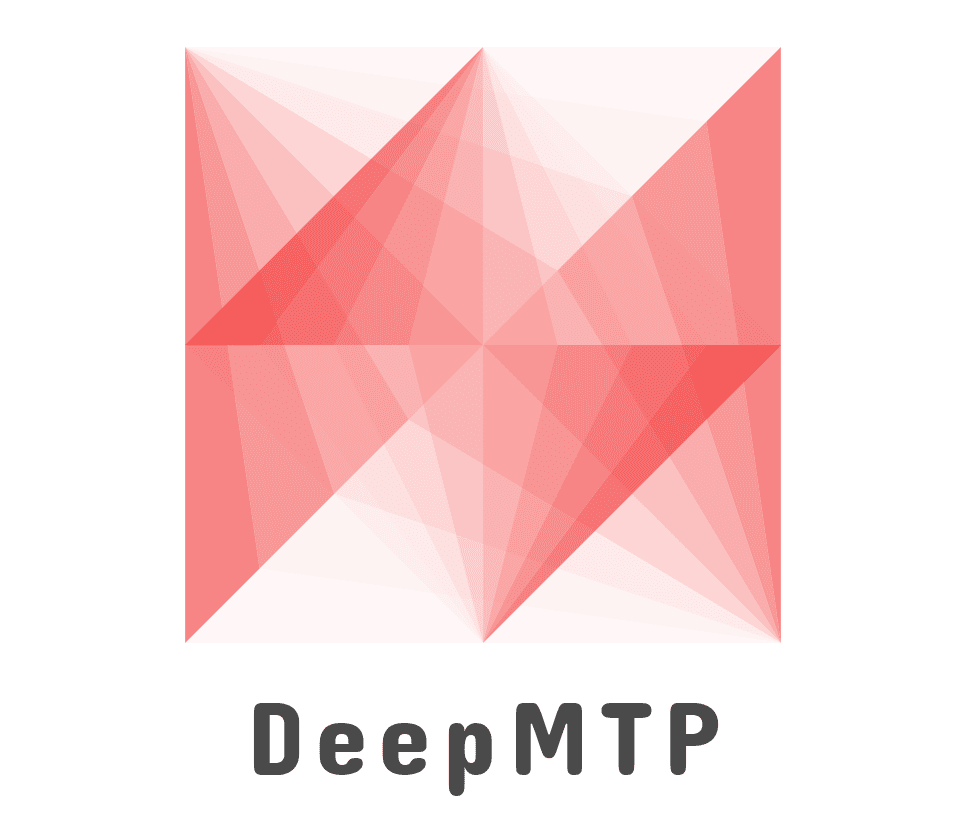

<p align="center"></p>

<h3 align="center">
<p> A Deep Learning Framework for Multi-target Prediction </h3>
<h4 align="center">
<p> Can be used for multiple multi-target prediction problems like multi-label classification, multivariate regression, multi-task learning, dyadic prediction and matrix completion </h4>

This is the official repository of DeepMTP, a deep learning framework that can be used with multi-target prediction (MTP) problems. MTP can be seen as an umbrella term that cover many subareas of machine learning, which include multi-label classification (MLC), multivariate regression (MTR), multi-task learning (MTL), dyadic prediction (DP), and matrix completion (MC). The implementation is mainly written in Python and uses Pytorch for the implementation of the neural network. The goal is for any user to be able to train a model using only a few lines of code.

### Latest Updates
- [1/6/2022] The first implementation of DeepMTP is now live!!!


## Cite Us

If you use this package, please cite [our paper](https://link.springer.com/article/10.1007/s10994-021-06104-5):
```
@article{iliadis2022multi,
  title={Multi-target prediction for dummies using two-branch neural networks},
  author={Iliadis, Dimitrios and De Baets, Bernard and Waegeman, Willem},
  journal={Machine Learning},
  pages={1--34},
  year={2022},
  publisher={Springer}
}
```